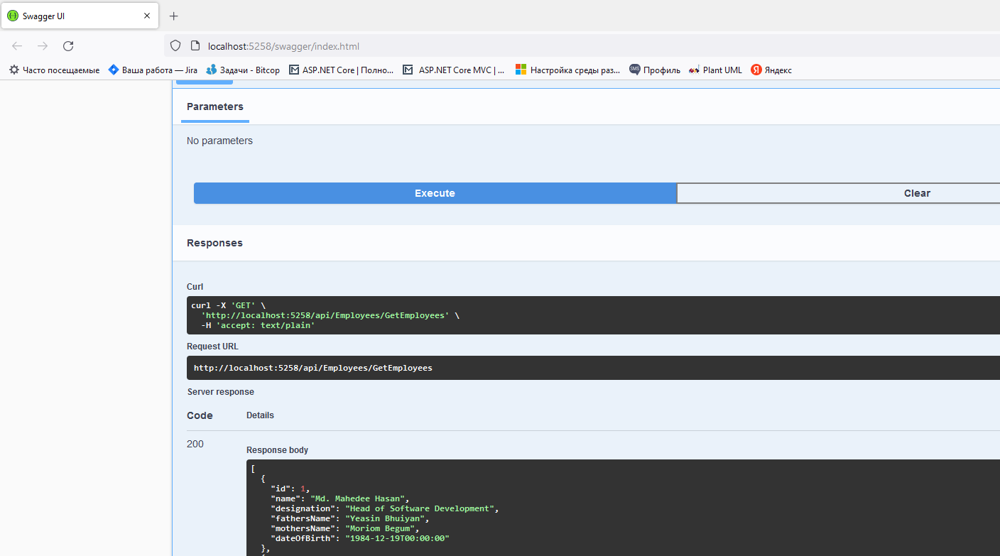

# CI/CD

Тема незнакома, поэтому просто попробовал по [Ссылка](https://mahedee.net/configure-ci-cd-pipeline-with-jenkins-github-and-asp.net-core/) повторить.
Решил попробовать связать разработку простейшего ASP .Net Core приложения с Jenkins

Установил

Создал тестовый проект (оригинал с небольшими правками), запустил

На всякий случай проверил из VS публикацию, потом удалил файлы
