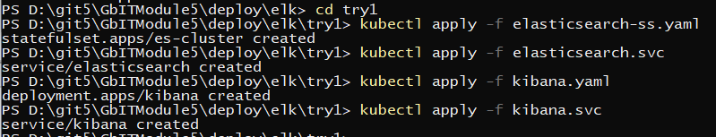
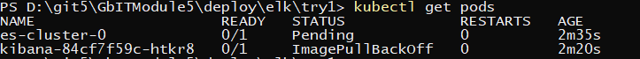
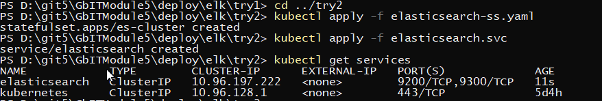
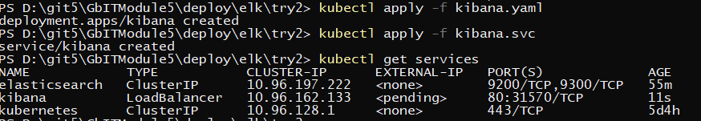
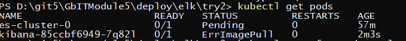
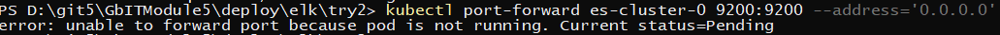
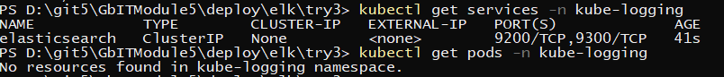
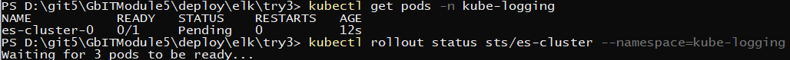
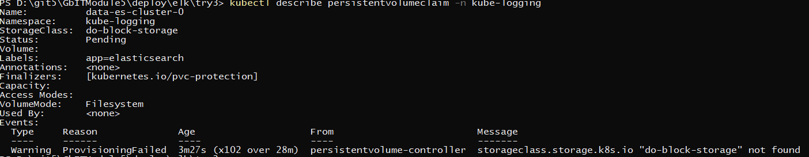
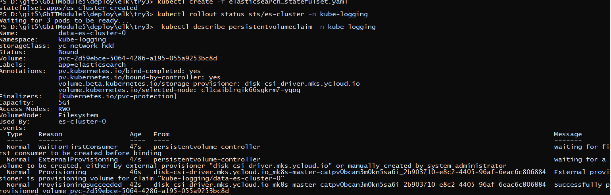

# ELK

### Так как в методичке используется ingreы для kibana - не имея своего домена вместо ingres использую LoadBalancer [kibana.svc](kibana.svc)


## Попытка развернуть по методичке

[elasticsearch-ss.yaml](try1/elasticsearch-ss.yaml)
[elasticsearch.svc](try1/elasticsearch.svc)
[kibana.yaml](try1/kibana.yaml)
[kibana.svc](try1/kibana.svc)

```
cd try01
kubectl apply -f elasticsearch-ss.yaml

kubectl apply -f elasticsearch.svc

kubectl apply -f kibana.yaml

kubectl apply -f kibana.svc
```



смотрю сервисы и поды

```
kubectl get services

kubectl get pods
```
и вижу что что-то пошло не так



анализирую файлы
смутило 2 места
>    value: http://elasticsearch:9200 
в [kibana.yaml](try1/kibana.yaml)


>    clusterIP: None
в [elasticsearch.svc](try1/elasticsearch.svc)
 
 
## Попытка 2 

удаляю 

```
kubectl delete -f kibana.svc

kubectl delete -f kibana.yaml

kubectl delete -f elasticsearch.svc

kubectl delete -f elasticsearch-ss.yaml

cd ..
```
изменяю

[elasticsearch-ss.yaml](try2/elasticsearch-ss.yaml)
[elasticsearch.svc](try2/elasticsearch.svc)


запускаю elasticsearch и смотрю адрес сервиса

```
cd try2
kubectl apply -f elasticsearch-ss.yaml

kubectl apply -f elasticsearch.svc

kubectl get services
```



правлю [kibana.yaml](try2/kibana.yaml) и запускаю дальше 

```
kubectl apply -f kibana.yaml

kubectl apply -f kibana.svc

kubectl get services
```



тоже не работает, смотрю поды
```
kubectl get pods
```


и видно что pod с elasticsearch не стартовал нормально

пробую его пробросить

```
kubectl port-forward es-cluster-0 9200:9200 --address='0.0.0.0'
```
разумеется не получается




## Попытка 3

[интернет](https://www.digitalocean.com/community/tutorials/how-to-set-up-an-elasticsearch-fluentd-and-kibana-efk-logging-stack-on-kubernetes-ru)

[kube-logging.yaml](try3/kube-logging.yaml)
[elasticsearch_svc.yaml](try3/elasticsearch_svc.yaml)

```
cd try3
kubectl get namespaces
kubectl create -f kube-logging.yaml
kubectl create -f elasticsearch_svc.yaml
get services -n kube-logging
```


[elasticsearch_statefulset.yaml](try3/elasticsearch_statefulset.yaml)

```
kubectl create -f elasticsearch_statefulset.yaml
kubectl get pods -n kube-logging
kubectl rollout status sts/es-cluster --namespace=kube-logging
```



И тут меня осенило. Дело было не в бобине.



сменил тип диска

```
kubectl create -f elasticsearch_statefulset.yaml
```


и пошла другая ошибка


