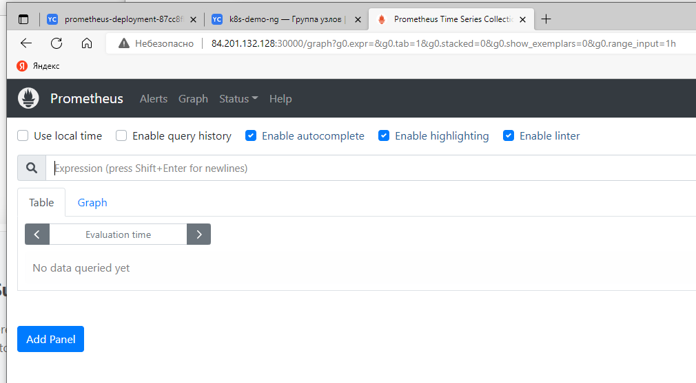
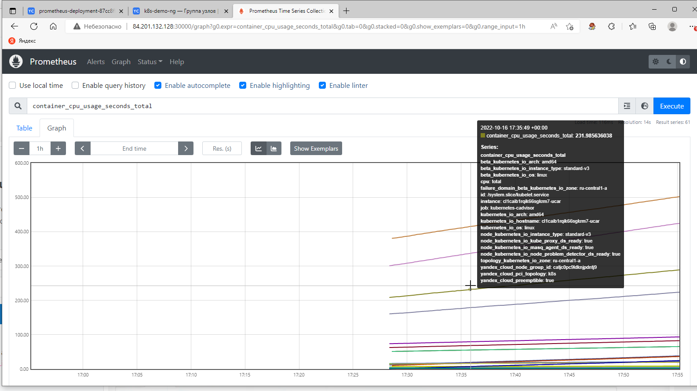

# Разворачивание Prometheus

Делал по [инструкция](https://devopscube.com/setup-prometheus-monitoring-on-kubernetes/)

## Создаем namespace, [роли](prometheus/clusterRole.yaml), [конфиг-мап](prometheus/config-map.yaml), [деплой](prometheus/prometheus-deployment.yaml)

```
kubectl create namespace monitoring

kubectl create -f prometheus/clusterRole.yaml

kubectl create -f prometheus/config-map.yaml

kubectl create  -f prometheus/prometheus-deployment.yaml
```

## разворачиваем

```
kubectl get deployments --namespace=monitoring

kubectl get pods --namespace=monitoring
```

## пробуем проброс портов
```
kubectl port-forward prometheus-deployment-87cc8fb88-qm5m7 8080:9090 -n monitoring --address='0.0.0.0'

http://localhost:8080

```
А как это колдунство работает?

## создаем сервис
```
kubectl create -f prometheus-service.yaml --namespace=monitoring
```





#Развернем nginx