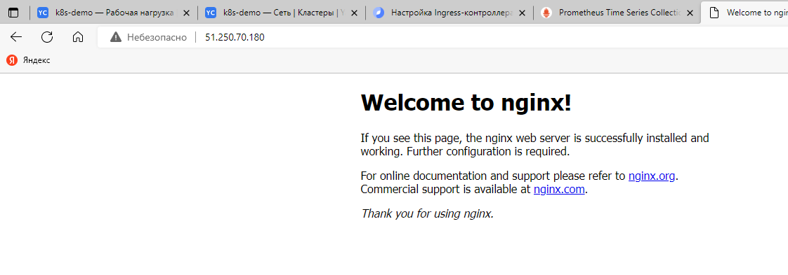
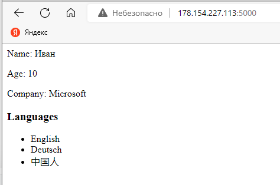
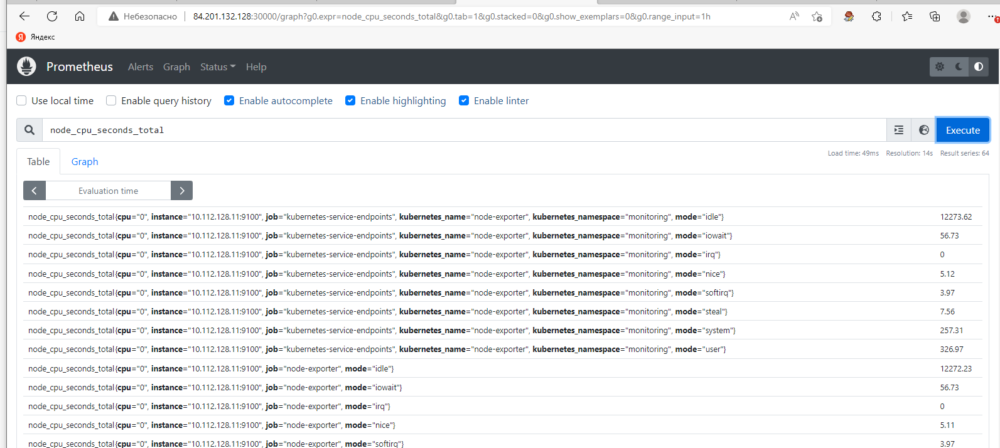
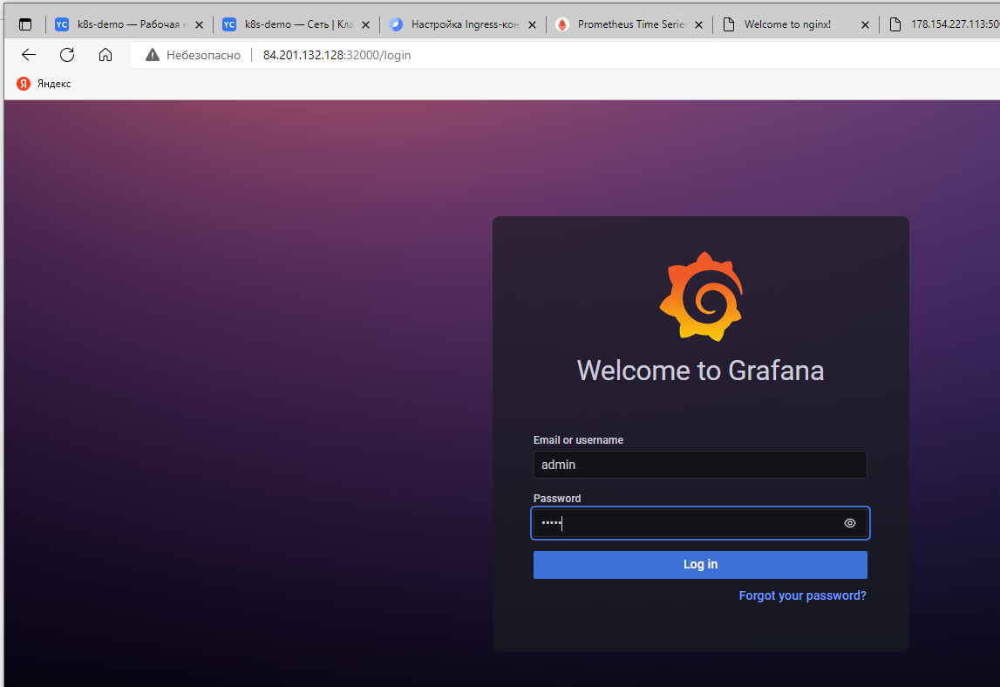
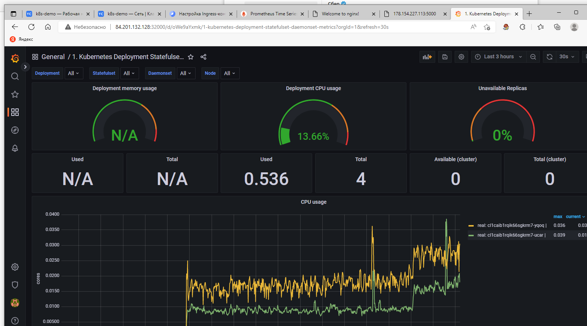

# Мониторинг

## Разворачивание Prometheus

Делал по [инструкция](https://devopscube.com/setup-prometheus-monitoring-on-kubernetes/)

### Создаем namespace, [роли](prometheus/clusterRole.yaml), [конфиг-мап](prometheus/config-map.yaml), [деплой](prometheus/prometheus-deployment.yaml)

```
kubectl create namespace monitoring

kubectl create -f prometheus/clusterRole.yaml

kubectl create -f prometheus/config-map.yaml

kubectl create  -f prometheus/prometheus-deployment.yaml
```

### разворачиваем

```
kubectl get deployments --namespace=monitoring

kubectl get pods --namespace=monitoring
```

### пробуем проброс портов
```
kubectl port-forward prometheus-deployment-87cc8fb88-qm5m7 8080:9090 -n monitoring --address='0.0.0.0'

http://localhost:8080

```
А как это колдунство работает?

### создаем [сервис](prometheus/prometheus-service.yaml)
```
kubectl create -f prometheus/prometheus-service.yaml --namespace=monitoring
```


## Развернем nginx

```
kubectl create namespace monitoring

kubectl create  -f nginx/nginx-deployment.yaml

kubectl get pods --namespace test

kubectl get deployments --namespace test

kubectl expose deployment nginx-nube --name mginx-test --type=LoadBalancer --namespace=test

```


## Развернем тестовое приложение

в [test.md](tests/TEST.md) прикрутили его из Docker

```
kubectl apply -f net_app/net-app.yaml

kubectl expose deployment net-app-test --name app-test --type=LoadBalancer --namespace=test

kubectl get services --namespace=test
```




## node-exporter

[daemonset.yaml](nodeexporter/daemonset.yaml)

[service.yaml](nodeexporter/service.yaml)

```
kubectl create -f nodeexporter/daemonset.yaml

kubectl get daemonset -n monitoring

kubectl create -f nodeexporter/service.yaml

kubectl get endpoints -n monitoring 
```




## grafana

[grafana-datasource-config.yaml](grafana/grafana-datasource-config.yaml)

[deployment.yaml](grafana/deployment.yaml)

[service.yaml](grafana/service.yaml)

```
kubectl create -f grafana/grafana-datasource-config.yaml

kubectl create -f grafana/deployment.yaml

kubectl create -f grafana/service.yaml

kubectl get services --namespace=monitoring
```




##
Эмуляция нагрузки

А вот здесь не разобрался 
