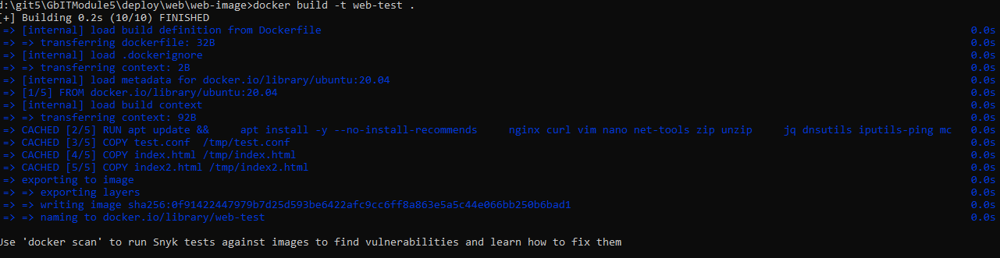
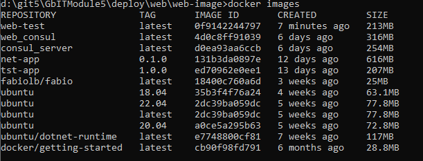

# Конфигурирование NGINX

Для тестов создаю образ [Dockerfile](web-image/Dockerfile)

строим  -  
```
cd web-image
docker build -t web-test .
``` 

```
docker images
``` 


контейнеры создались, запустились и остановились

