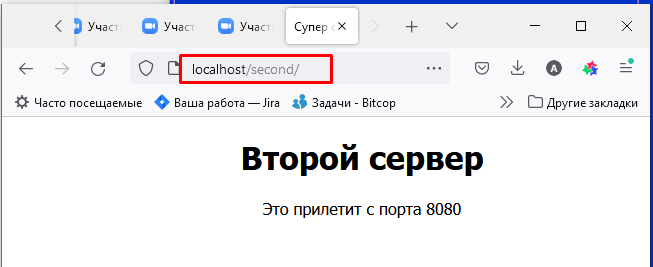

# Конфигурирование NGINX

## Подготовка стенда
Для тестов создаю образ [Dockerfile](web-image/Dockerfile)

```
cd web-image
docker build -t web-test .
``` 


```
docker images
``` 


создаем сеть
```
docker network create --driver=bridge --subnet=192.168.99.0/24 net_99
docker network ls -f name=net_99
```


Создаем контейнер, проверяем, выходим, стартуем
```
docker run -it -h ngx --name web-main -p 80:80 -p 8080:8080 -p 8081:8081 --net net_99 --ip 192.168.99.11 -v d:\git5\GbITModule5\deploy\web\u\web-test:/u01 web-test
ifconfig
ps -ef
which nginx
ls -l /u01
выход
docker start web-main
docker ps
```


Подключаемся, переносим файлы из /tmp, настраиваем хранение логов каталоги в /u01
```
docker exec -it web-main bash
mc
...
```


Далее все конфиги в каталоге [/u01/conf](u/web-test/conf)

основной конфиг nginx скопирован в [/u01/conf/nginx.conf](u/web-test/conf/nginx.conf)
```
nginx -t
nginx
ps -ef
```


## Тесты

### 0. Проверка работы

Копия конфига /etc/nginx/sites-enabled/test.conf -> [/u01/conf/test_0.conf](u/web-test/conf/test_0.conf)

### 1. Динамическая перезагрузка конфигурации
```
nginx -s  reload
```


Копия конфига /etc/nginx/sites-enabled/test.conf -> [/u01/conf/test_1.conf](u/web-test/conf/test_1.conf)

### 2. Добавление location


Копия конфига /etc/nginx/sites-enabled/test.conf -> [/u01/conf/test_2.conf](u/web-test/conf/test_2.conf)

### 3. Proxy





Копия конфига /etc/nginx/sites-enabled/test.conf -> [/u01/conf/test_3.conf](u/web-test/conf/test_3.conf)

### 4. Proxy (вариант)
данные с основного сервера 


данные со второго


Логи


Копия конфига /etc/nginx/sites-enabled/test.conf -> [/u01/conf/test_4.conf](u/web-test/conf/test_4.conf)

#### Каталог [/u01](u/web-test)
